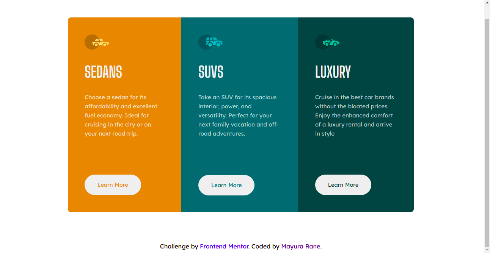
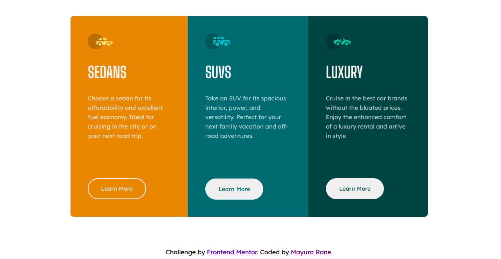
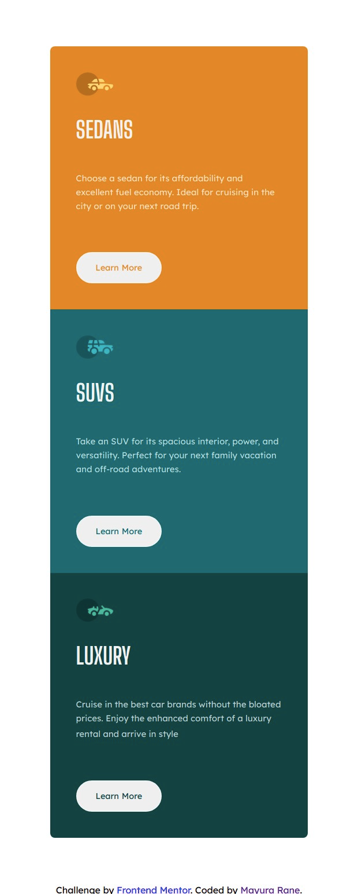

# Frontend Mentor: 3-column preview card component solution

This is a solution to the [3-column preview card component challenge on Frontend Mentor](https://www.frontendmentor.io/challenges/3column-preview-card-component-pH92eAR2-). Frontend Mentor challenges help you improve your coding skills by building realistic projects. 

## Table of contents

- [Overview](#overview)
  - [The challenge](#the-challenge)
  - [Screenshot](#screenshot)
  - [Links](#links)
- [My process](#my-process)
  - [Built with](#built-with)
  - [What I learned](#what-i-learned)
  - [Continued development](#continued-development)
  - [Useful resources](#useful-resources)
- [Author](#author)
- [Acknowledgments](#acknowledgments)

## Overview

### The challenge

Users should be able to:

- View the optimal layout depending on their device's screen size
- See hover states for interactive elements

### Screenshot

<<<<<<< HEAD
Desktop View:

Hover State:

Mobile View:

=======
Desktop view:
![Alt text] (https://github.com/MayuraRane/3-column-preview-card-component/blob/master/design/3-column-preview-card-desktop.png?raw=true "Desktop View)

Hover state:
![Alt text] (https://github.com/MayuraRane/3-column-preview-card-component/blob/master/design/3%20column%20preview%20active.png?raw=true "Hover State")

Mobile view:
![Alt text] (https://github.com/MayuraRane/3-column-preview-card-component/blob/master/design/3-column-preview-card-mobile.png?raw=true "Mobile View")
>>>>>>> 0deb7b1f2c908b28cb0b48e60a8ef98f54594b1e

### Links

- Solution URL: [Add solution URL here](https://your-solution-url.com)
- Live Site URL: [Add live site URL here](https://your-live-site-url.com)

## My process

### Built with

- Semantic HTML5 markup
- CSS custom properties
- Flexbox

### What I learned

- Use of flexbox for desktop and for mobile devices.
- Use of @media query
- Version control

### Continued development

This was my first Frontend Mentor challenge. I would like to do the same project using SASS.

### Useful resources

- [W3 Schools](https://www.w3schools.com/css/css3_flexbox_responsive.asp) - This helped me with making flexbox responsive.
- [Frontend Mentor Slack community](https://app.slack.com/client/TCYEB44S2/CDC7K7G1L) - This is an amazing place to check out other people's codes and also to ask question regarding specific challenges.

## Author

- Frontend Mentor - [@MayuraRane](https://www.frontendmentor.io/profile/MayuraRane)
- Twitter - [@mayura_rane](https://www.twitter.com/mayura_rane)
- LinkedIn - [@mayurarane] (https://www.linkedin.com/in/mayurarane/)

## Acknowledgments

Thank you [Oscar Bocanegra] (https://github.com/OscarBocanegra95) for helping me find the minor error in my code.

